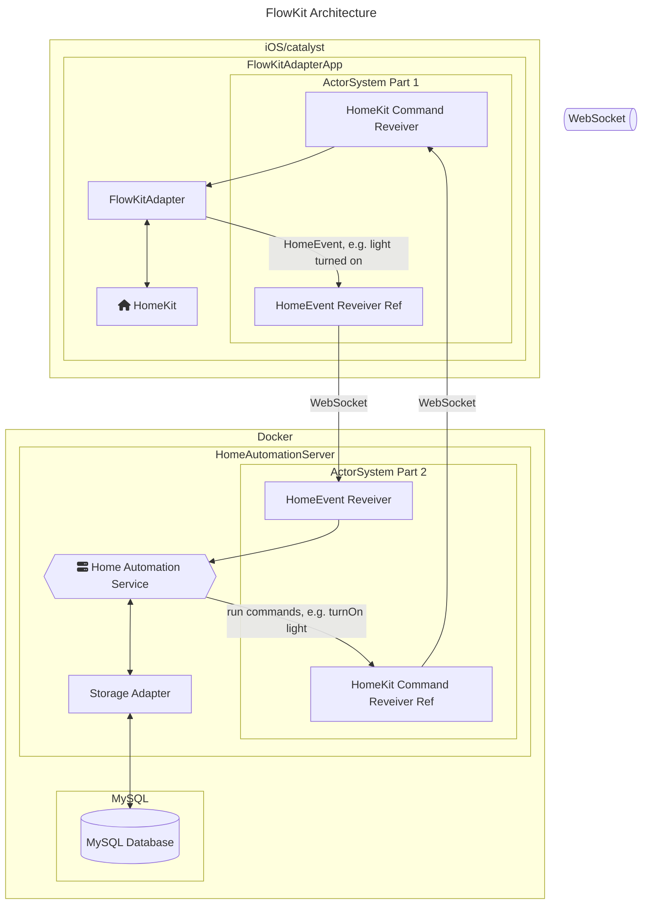

# HomeAutomation

**HomeAutomation** is smart home automation system that connects to [HomeKit](https://developer.apple.com/documentation/homekit).

By subscribing to events that happen in the HomeKit ecosystem, you are able to perform complex automations that can be written and tested in Swift.

Main goals:

* ability to create of complex automations (see `HAImplemenations`)
* cooperation with HomeKit: You can/should still use the Home.app/HomePods etc. for manually setting entities

## Architecture

## Project Structure & Glossary

* `FlowKit Server`: [Vapor](https://vapor.codes) server that contains the business logic e.g. receives `HomeEvent`s, triggers automations, servers the config and persists Entities.
* `HomeAutomationKit`: Package the contains the entities etc. that are shared between the server and other parts of the system.
* `FlowKit Adapter`: A macOS catalyst/iOS app that must run in foreground (because of HomeKit privacy implications). It sends `HomeEvent`s to the server and receives commands (e.g. `HomeManagableAction`) that will be forwarded to HomeKit.

Besides the main project structure there are a few more elements in the project that are defined here:

* Entity: characteristic of a device in HomeKit, e.g. the light sensor of a Eve Motion device.
* HomeEvent: event that might trigger an automation, e.g. `.sunrise` or the change of an entity.
* HomeManagableAction: action that will can be processed by the `FlowKit Adapter` app.

## Further Information

* [Server Setup](./docs/setup-server.md)
* [FlowKit Adapter Setup](./docs/setup-FlowKitAdapter.md)
