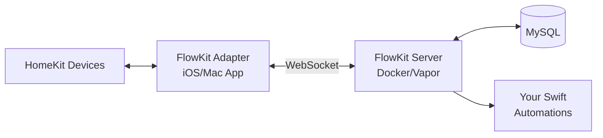

# HomeAutomation (FlowKit)

Write testable HomeKit automations in Swift that run 24/7 on your server.

## Why FlowKit?

- **Write in Swift**: Testable, type-safe automations vs HomeKit's limited rules
- **Complex Logic**: Multi-sensor triggers, weather APIs, energy pricing, time-based conditions
- **24/7 Server Runtime**: Runs independently of iOS devices being unlocked
- **Built-in Automations**: Motion-activated lighting, window monitoring, garden watering, energy optimization

## Example Automation

```swift
public struct MotionAtNight: Automatable {
    public let motionSensor: MotionSensorDevice

    public let lightSensor: MotionSensorDevice
    public let lights: [SwitchDevice]

    public func shouldTrigger(with event: HomeEvent, using hm: HomeManagable) async throws -> Bool {
        let motionDetected = try await motionSensor.motionDetectedState(with: hm)
        let lux = try await lightSensor.illuminanceState(with: hm)
        return motionDetected && lux.value < 60.0
    }

    public func execute(using hm: HomeManagable) async throws {
        await lights.forEach { $0.setBrightness(to: 0.3, with: hm) }
        try await Task.sleep(for: .seconds(60))
        await lights.forEach { $0.turnOff(with: hm) }
    }
}
```

**More Examples**: [MotionAtNight.swift](Sources/HAImplementations/Automations/MotionAtNight.swift) • [WindowOpen.swift](Sources/HAImplementations/Automations/WindowOpen.swift) • [GardenWatering.swift](Sources/HAImplementations/Automations/GardenWatering.swift)

## Prerequisites

- **HomeKit Setup**: Existing HomeKit home with compatible devices
- **Apple Device**: iPhone/iPad or Mac (FlowKit Adapter must run in foreground)
- **Server**: Docker + MySQL-compatible database
- **Developer Tools**: Swift 6.0+, Xcode (for building iOS apps)
- **Optional**: Tibber API key (for energy price automations)

## Quick Start

1. **Deploy Server**:
   ```bash
   docker-compose build
   docker-compose up -d
   ```

2. **Configure Authentication**: Generate and set API token
   ```bash
   # Generate secure token
   openssl rand -base64 32

   # Set in environment (add to .env or docker-compose.yml)
   export AUTH_TOKEN="your-generated-token-here"
   ```

3. **Configure Database**: Set `DATABASE_URL` environment variable (MySQL connection string)

4. **Build & Run FlowKit Adapter**:
   ```bash
   cd Apps/FlowKitAdapter
   xcodebuild -scheme "FlowKit Adapter" -configuration Release
   ```
   Launch app, grant HomeKit permissions, configure server URL and auth token in settings

5. **Write Automations**: Implement `Automatable` protocol in `Sources/HAImplementations/Automations/`

**[Detailed Setup →](./docs/setup-server.md)**

## Architecture



**Distributed System**: Adapter forwards HomeKit events to server via WebSocket, server executes automations and sends commands back.

**Security**: All HTTP endpoints (port 8080) require Bearer token authentication. Configure `AUTH_TOKEN` environment variable before deployment.

## Project Structure

- `Sources/HAImplementations/Automations/` - Built-in automation examples
- `Sources/HAModels/` - Shared models (entities, events, devices)
- `Sources/Server/` - Vapor server business logic
- `Apps/FlowKitAdapter/` - iOS/macOS HomeKit bridge app
- `Apps/FlowKitController/` - iOS management app

## Writing Custom Automations

Implement the `Automatable` protocol:

```swift
public protocol Automatable {
    var name: String { get }
    var triggerEntityIds: Set<EntityId> { get }  // Sensors/devices that trigger this
    func shouldTrigger(with event: HomeEvent, using hm: HomeManagable) async throws -> Bool
    func execute(using hm: HomeManagable) async throws
}
```

Add your automation to `Sources/HAImplementations/Automations/` and register in `AnyAutomation`.

## Further Information

- [Server Setup](./docs/setup-server.md)
- [FlowKit Adapter Setup](./docs/setup-FlowKitAdapter.md)
