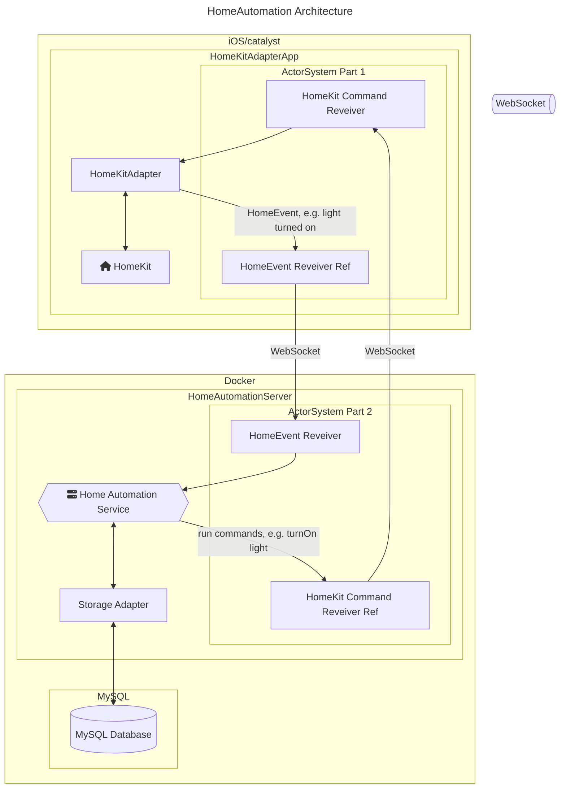

# HomeAutomation

**HomeAutomation** is smart home automation system that connects to [HomeKit](https://developer.apple.com/documentation/homekit).

By subscribing to events that happen in the HomeKit ecosystem, you are able to perform complex automations that can be written and tested in Swift.

Main goals:

* ability to create of complex automations (see `HAImplemenations`)
* cooperation with HomeKit: You can/should still use the Home.app/HomePods etc. for manually setting entities

## Next Steps

* [x] build a workspace
* [x] continue with this README.md
* [x] check if parts of `HomeAutomationKit` should be moved to `HomeAutomationServer`
* [x] App: set dynamically host/port
* [x] App: test if it keeps running, e.g. disable sleep
* [x] swiftlint add sorting imports
* [x] Abstract websocketsactor system so it will only be a dependency in HomeAutomationKit
* [ ] Server: check for item deduplication
* [ ] dyanmically load config on server
* [ ] use env vars instead of keychain helper for configuring tibber
* [ ] fix TODOs in code

## Architecture

## Project Structure & Glossary

* `HomeAutomationServer`: [Vapor](https://vapor.codes) server that contains the business logic e.g. receives `HomeEvent`s, triggers automations, servers the config and persists Entities.
* `HomeAutomationKit`: Package the contains the entities etc. that are shared between the server and other parts of the system.
* `HomeKitAdapterApp`: A macOS catalyst/iOS app that must run in foreground (because of HomeKit privacy implications). It sends `HomeEvent`s to the server and receives commands (e.g. `HomeManagableAction`) that will be forwarded to HomeKit.

Besides the main project structure there are a few more elements in the project that are defined here:

* Entity: characteristic of a device in HomeKit, e.g. the light sensor of a Eve Motion device.
* HomeEvent: event that might trigger an automation, e.g. `.sunrise` or the change of an entity.
* HomeManagableAction: action that will can be processed by the `HomeKitAdapterApp`.

## Further Information

* [Server Setup](./docs/setup-server.md)
* [HomeKitAdapterApp Setup](./docs/setup-homekitadapterapp.md)
